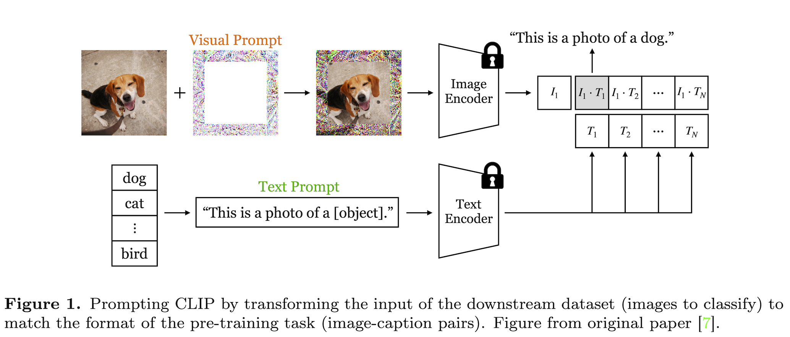
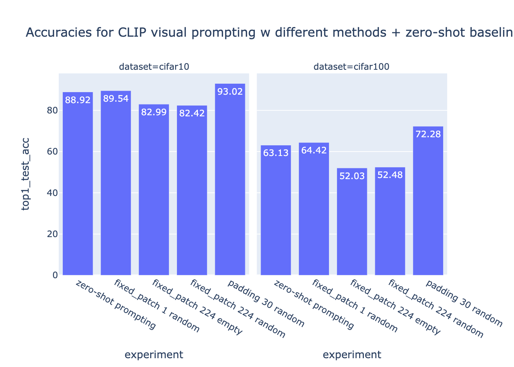
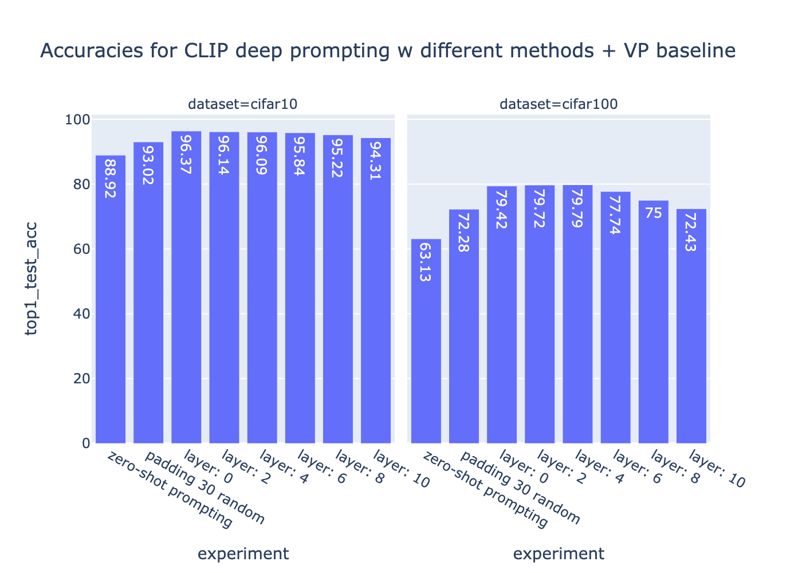
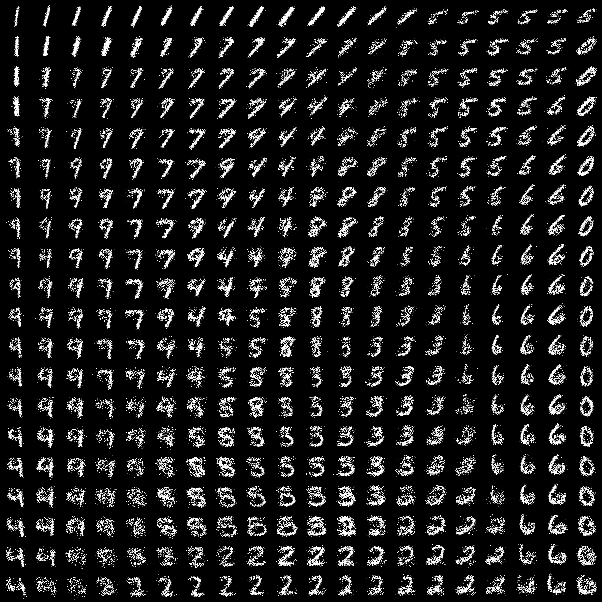

# Assignments of the UvA Deep Learning 1 course (2023)

Assignments for the course [UvA Deep Learning 1 course](https://uvadlc.github.io/), based on the templates in [uvadlc_practicals_2023](https://github.com/uvadlc/uvadlc_practicals_2023)

## Transfer Learning for CNNs, Visual Prompting, Graph Neural Networks

Full description: [assignment2/DL1_Assignment_2.pdf](assignment2/DL1_Assignment_2.pdf)

### Transfer Learning for CNNs
Adaptation of a ResNet-18 model that was pre-trained on ImageNet to CIFAR-100, via randomly resetting its last layer’s parameters and retraining only that layer. Augmentation is applied to increase the model’s performance.

- Solution: [part1/train.py](assignment2/part1/train.py)

### Visual Prompting

Prompting has been recently popularized in NLP as a method of adapting (large) language models to new downstream tasks. The core idea is to perform a transformation in the data space rather than the model space in order to achieve the sought objective, which is different from the one that the model was originally trained on. This differs to common transfer learning approaches as prompting modifies the existing model’s input rather than some neural weights. Contemporary work has transferred this paradigm to the domain of Computer Vision, where they attempt to prompt the Vision Transformer in CLIP (among other vision models) to perform a task that it has never been trained on (zero-shot). The results show that visual prompting is particularly effective for CLIP, as it manages to perform on par with other standard adaptation techniques such as linear probes. Additionally, once a visual prompt has been learnt, it can be applied to images that come from a different distribution (such as a dataset with different properties) without as big of an impact on performance, compared to other common approaches. More details can be found in the [original paper](https://arxiv.org/pdf/2203.17274.pdf for more details).

#### CLIP Zero-shot baseline

Evaluation of the zero-shot abilities of CLIP in image classification, which serves as a baseline.

Solution in [clipzs.py](assignment2/part2/clipzs.py)

#### Learning a visual prompt

Learning of a visual prompt to apply on top of the dataset’s images. This allows us to essentially steer the model to perform better at the task we are interested in. One advantage of prompting in the vision domain is that the input space (pixel values) is inherently continuous, while in language it is discrete (word tokens). Thus, we can back-propagate the loss to the input and update our prompt according to the gradients, in order to increase the effectiveness of the model.
 
The area of the image where we apply the visual prompt, as well as its size, naturally determine its impact, so we tested two options - using a single pixel patch (1x1 px) at a fixed location, or a frame at the edges of the image. 

Solution in [learner.py](assignment2/part2/learner.py), [vpt_model.py](assignment2/part2/vpt_model.py), [vp.py](assignment2/part2/vp.py). 

#### Learning deep prompts

So far, the visual prompts were applied to the input of the model in the image space. An alternative approach is to depart from the image space and learn so-called deep prompts that are added as tokens to an intermediate representation within some layer of the model. In other words, instead of adding the prompts to an image, they will be appended to the list of original tokens determined based on the input. In the case of CLIP, these deep tokens can be injected before any one of the Transformer blocks.

Solution in [dpt_model.py](assignment2/part2/dpt_model.py)

## Deep Generative Models and Transformer-based Models

Modelling distributions in high dimensional spaces is difficult. Simple distributions such as multivariate Gaussians or mixture models are not powerful enough to model complicated high-dimensional distributions. The question is: How can we design complicated distributions over high-dimensional data, such as images or audio?  The solution: Deep Generative Models.

Deep generative models come in many flavors, but all share a common goal: to model the probability distribution of the data. Examples of well-known generative models are Variational Autoencoders (VAEs) [Kingma and Welling, 2014], Generative Adversarial Networks (GANs) [Goodfellow et al., 2014], Adversarial Autoencoder Networks (AAEs) [Makhzani et al., 2015], and Normalizing Flows (NF) [Rezende and Mohamed, 2015]. Here we focus on VAEs and AAEs.

Full description: [assignment3/DL1_Assignment_3.pdf](assignment3/DL1_Assignment_3.pdf)

### Variational Autoencoders

Implementation of a Variational Autoencoder, trained on the MNIST dataset. Both the encoder and decoder are implemented as a CNN. 

Solution in [train_pl.py](assignment3/part1/train_pl.py)

Data manifold of a VAE with 2 hidden dimensions on MNIST:

### Adversarial Autoencoders

Generative Adversarial Networks (GANs) are another type of deep generative models. Similar to VAEs, GANs can generate images that mimic images from the dataset by sampling an encoding from a noise distribution. In contrast to VAEs, in vanilla GANs there is no inference mechanism to determine an encoding or latent vector that corresponds to a given data point (or image). A GAN consists of two separate networks (i.e., there is no parameter sharing or the like) called the generator and the discriminator. Training a GAN leverages an adversarial training scheme. In short, that means that instead of defining a loss function by hand (e.g., cross-entropy or mean squared error), we train a network that acts as a loss function. In the case of a GAN this network is trained to discriminate between real images and fake (or generated) images, hence the name discriminator. The discriminator (together with the training data) then serves as a loss function for our generator network that will learn to generate images to are similar to those in the training set. Both the generator and discriminator are trained jointly.

Traditional or vanilla GANs have no control over the generated samples and it is hard to predict which noise signal will produce our desired sample. Adversarial autoencoders solve this problem by mixing the benefits from both GANs and autoencoders. Adversarial autoencoders are similar to variational autoencoders, in that they also try to impose a prior on the hidden code vector of the autoencoder, however they use an adversarial training procedure to match the hidden vector distribution with the prior distribution [Makhzani et al., 2015].

Solution: [models.py](assignment3/part2/models.py)

## MLPs and Backpropagation
From-scratch implementation and training of a basic MLP neural architecture for a classification task. 

Full description: [assignment1/DL1_Assignment_1.pdf](assignment1/DL1_Assignment_1.pdf)

- Solution: [assignment1/DL1_Assignment_1_solution.pdf](assignment1/DL1_Assignment_1.pdf)
- NumPy implementation in [mlp_numpy](assignment1/mlp_numpy.py), [train_mlp_numpy](assignment1/train_mlp_numpy.py), [modules](assignment1/modules.py)
- PyTorch implementation in [mlp_pytorch](assignment1/mlp_pytorch.py), [train_mlp_pytorch](assignment1/train_mlp_pytorch.py)
